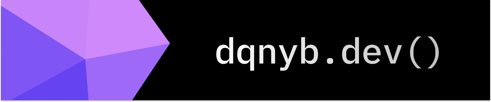

## 📌 About Me

🎓 Computer Science student at the National University of Science and Technology Politehnica Bucharest.  
🛠️ Passionate about programming, algorithms, AI, and web development.  
💡 Experienced with smart chatbots, automated quiz platforms, management systems, and image processing apps.  
🚀 Always learning, experimenting, and building efficient, real-world solutions.  
📈 Growing in machine learning, full-stack development, and data automation.

---

## 🛠️ Tools

  

---

## 🚀 All Public Repositories

- 🏛️ [MuseumManager](https://github.com/dqnyb/MuseumManager)  
  Java app for managing museums, exhibits, and user interactions.

- ✈️ [Air-Traffic-Control](https://github.com/dqnyb/Air-Traffic-Control)  
  Java app for managing Air-Traffic-Control

- 🗳️ [SmartVote-App](https://github.com/dqnyb/SmartVote-App)  
  Java-based voting system with secure vote handling and clean UI.

- ⚙️ [Async-Web-Server](https://github.com/dqnyb/Async-Web-Server)  
  Asynchronous, performant HTTP web server built in C from scratch.

- 💻 [Mini-Shell](https://github.com/dqnyb/Mini-Shell)  
  Educational Unix shell written in C, supporting job control and piping.

- 🔥 [Parallel-Firewall](https://github.com/dqnyb/Parallel-Firewall)  
  Multithreaded packet filter system simulating a firewall engine.

- 🧠 [Memory-Allocator](https://github.com/dqnyb/Memory-Allocator)  
  A malloc/free implementation in C — custom memory allocator.

- 🧱 [Mini-libc](https://github.com/dqnyb/Mini-libc)  
  Core libc functions implemented from scratch in C (no dependencies).

- 💬 [ChatBot-](https://github.com/dqnyb/ChatBot-)  
  Flask-based conversational chatbot with dynamic responses. + JavaScript .

- 🔍 [HtmlClonesDetector](https://github.com/dqnyb/HtmlClonesDetector)  
  CLI tool to detect structural similarities in HTML documents.

---

<picture>
  <source media="(prefers-color-scheme: dark)" srcset="https://raw.githubusercontent.com/tobiasmeyhoefer/tobiasmeyhoefer/output/github-snake-dark.svg" />
  <source media="(prefers-color-scheme: light)" srcset="https://raw.githubusercontent.com/tobiasmeyhoefer/tobiasmeyhoefer/output/github-snake.svg" />
  
</picture>

---

## 📬 Contact

- 📧 Email: [dqnyb@gmail.com](mailto:brinza.daniel2003@gmail.com)  
- 💼 LinkedIn: [linkedin.com/in/danielbrinza2](https://www.linkedin.com/in/danielbrinza2/)

---

